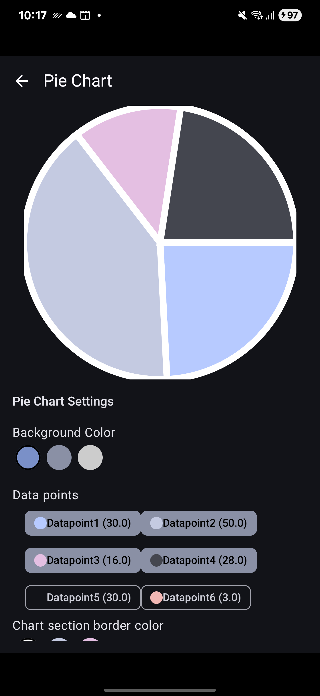
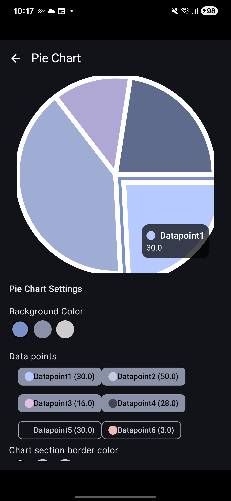

# Compose Chart SDK

A flexible and customizable charting SDK built with **Jetpack Compose**.

---

## Preview

### Pie Chart Data Points
Shows how raw data points are visualized inside a pie chart.

---

### Pie Chart Data Point Selection
Demonstrates interactive selection of a chart slice.

---

### Pie Chart Interactions
Example of configuring chart interactions such as selection and deselection.

---

## Examples

The module **`examples`** is included in the project.  
You can run it directly to see how the library looks and behaves after applying customizations.